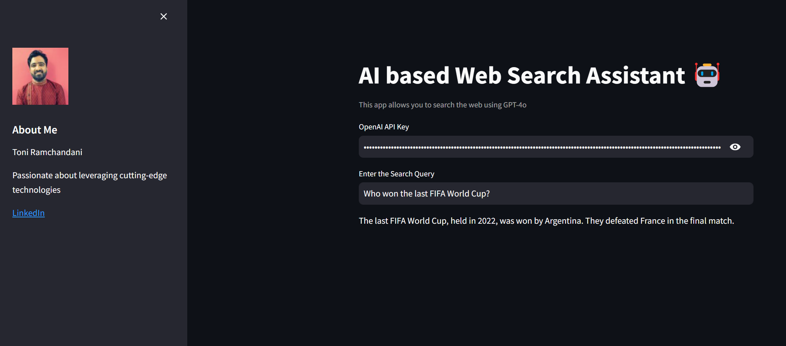

# AI Web Search Assistant 🤖

This project demonstrates how to create an AI-powered web search assistant using **GPT-4** and **Streamlit**. It integrates **DuckDuckGo** for real-time web searches and presents the results using GPT-4 to intelligently respond to user queries. The app also includes a personal touch by displaying a profile with a picture, bio, and LinkedIn link in the sidebar.

## Features

- **GPT-4 Powered**: Uses OpenAI's GPT-4 model to understand and respond to queries.
- **Real-Time Web Search**: Integrates DuckDuckGo for real-time web search results.
- **User-Friendly Interface**: Built using Streamlit, offering an intuitive and clean interface.
- **Secure**: API key is securely entered via password input for OpenAI access.
- **Personal Profile**: Displays your image, bio, and LinkedIn profile in the sidebar.

## Demo

## Requirements

- Python 3.7+
- OpenAI API Key
- DuckDuckGo API for web search
